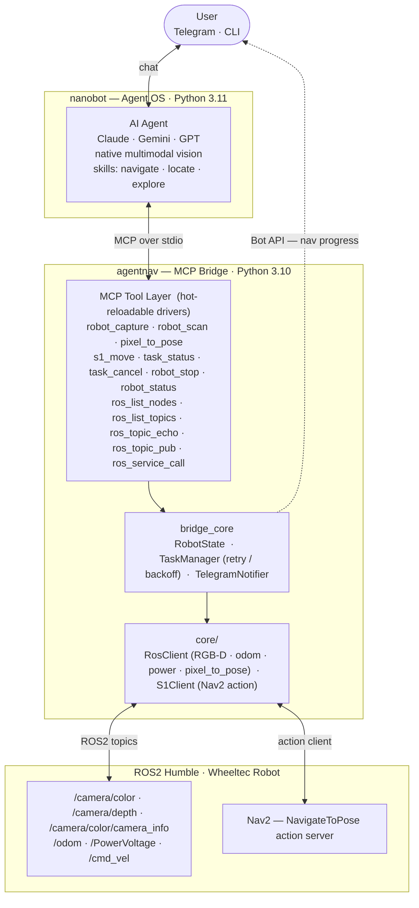

# 🤖 AgentNav: Agentic Robot Navigation Framework

<p align="center">
  <strong>English</strong> | <a href="README_AgentNav_CN.md">中文</a>
</p>

<p align="center">
  
  
  
  
  
</p>

<p align="center">
  <strong>"Stop hardcoding, start conversing."</strong><br>
  AgentNav is an open-source framework for agentic robot navigation — let a Multimodal AI Agent (Claude, Gemini, GPT) drive your robot using natural language and native vision.
</p>

<p align="center">
  <!-- Replace with your actual demo GIF or video -->
  
</p>

---

## 💡 Why Agentic Navigation?

Traditional navigation stacks are "black boxes": one goal in, success/failure out. The agent has no visibility into *why* a move failed or *how* to recover.

**AgentNav flips this.** Navigation becomes a transparent conversation between the AI "Brain" and the Robot "Limbs":

| Feature | Traditional Navigation | 🤖 AgentNav |
|:---|:---|:---|
| **Perception** | Requires predefined goal coordinates | **Natural language** + Live camera frames |
| **Visibility** | Agent is blind to progress | Agent **polls phase, distance, and status** |
| **Logic** | Hardcoded C++/Python pipelines | **Markdown-based skills** (taught, not coded) |
| **Vision** | Requires separate VLM/Object Detection | **Native Multimodal** (Agent sees pixels directly) |
| **Recovery** | Retries blindly or gives up | Agent **re-estimates and replans** on failure |

---

## 🚀 Key Features

- **👀 Native Multimodal Vision:** The agent perceives the scene directly via `robot_capture()` (MCP ImageContent). No middleman object detectors required.
- **🛠️ Zero-Shot Discovery:** Using `ros_list_*` tools, the agent can explore and understand any new robot's nodes, topics, and services dynamically.
- **🔄 Hot-Reloadable Drivers:** Add or update MCP tools (Python drivers) on-the-fly without losing conversation history.
- **🧠 Skill-Based Intelligence:** Complex behaviors (Search → Locate → Move) are taught via Markdown files, making the robot's "logic" as easy to update as a prompt.
- **🛡️ Safety First:** Built-in `robot_stop()` with < 50ms latency and safety-level tagging for all tools.

---

## 🏗️ Architecture



---

## 🧠 Defining Skills (The "Brain")

AgentNav uses **Skills** — Markdown files that guide the LLM on how to use tools. This allows for complex workflows without writing brittle code.

**Example: `skills/locate.md`**
> "To find an object: 
> 1. Use `robot_capture()` to see the scene.
> 2. If the target is found, estimate its pixel coordinates (u, v).
> 3. Call `pixel_to_pose(u, v)` to get robot-frame coordinates.
> 4. If not found, use `robot_scan()` to check 360°."

---

## 🔧 MCP Tool Reference (Partial)

### 📸 Perception & Motion
| Tool | Description | Safety |
|:---|:---|:---|
| `robot_capture()` | Returns live frame as **ImageContent**. | ✅ Safe |
| `pixel_to_pose(u, v)` | Converts pixels to `{x, y, theta}` using Depth data. | ✅ Safe |
| `s1_move(pose)` | Non-blocking move via Nav2. Returns `task_id`. | ⚠️ Caution |
| `robot_stop()` | **Emergency Stop.** Cancels all tasks immediately. | 🚨 Danger |

### 🔍 ROS2 Introspection
Empowers the agent to "learn" the robot's specific configuration:
- `ros_list_nodes()` / `ros_list_topics()`
- `ros_topic_echo()` / `ros_service_call()`

---

## 🛠️ Quick Start

### 1. Install nanobot
```bash
pip install nanobot-ai          # Python 3.11+
```

### 2. Configure Environment
Create a `.env` file (or export variables):
```bash
export ANTHROPIC_API_KEY=sk-ant-...
export TELEGRAM_BOT_TOKEN=123456:ABC-...
# See README for full list of TOPIC_ overrides
```

### 3. Launch
```bash
bash agentnav/scripts/start_robot_agent.sh
```

---

## 🗺️ Project Status & Roadmap

- [x] **Phase 1:** MCP Core & Hot-reload drivers
- [x] **Phase 2:** Native Vision (`robot_capture`) & ROS2 Introspection
- [x] **Phase 3:** Nav2 Integration & Coordinate conversion (`pixel_to_pose`)
- [ ] **Phase 4 (In Progress):** Closed-loop failure recovery & Skill optimization
- [ ] **Future:** Simulation support (Gazebo/Isaac Sim) 🏗️ *Help Wanted*
- [ ] **Future:** Multi-robot coordination 🤖🤖

---

## 🤝 Contributing

We welcome contributions! Whether it's a new **Driver** for a sensor, a new **Skill** for complex tasks, or support for a new **Robot Platform**.

1. Fork the repo
2. Create your feature branch
3. Submit a PR

---

## 📜 License
MIT License. See [LICENSE](LICENSE) for details.

---
<p align="center">Built with ❤️ for the Robotics & AI Community.</p>
