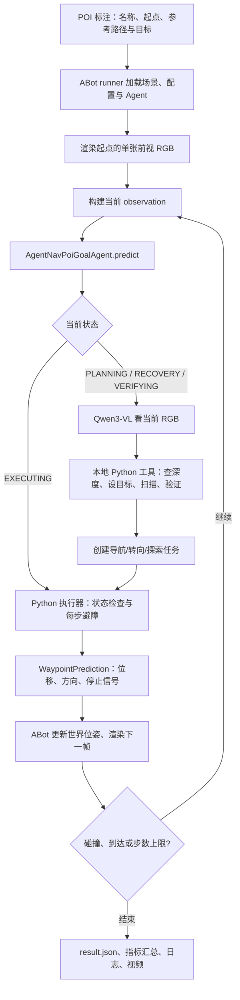

# AgentNav × ABot POI 导航：IPO

本文说明当前 `AgentNav/agentnav/abot` 实现如何在 ABot POI Goal 评测中运行。读者无需了解此前的 AgentNav、Nav2 或本项目的修改历史。文中代码片段用于解释关键接口；实验应运行仓库中的原文件。

## 1. 基础对象

| 名称 | 含义 | 负责 |
| --- | --- | --- |
| POI task | 一条寻找指定店铺/兴趣点的评测任务，例如寻找“麦当劳” | ABot 评测器 |
| 环境步 | 一次 `agent.predict(observation)`、一次位姿更新和一次新画面渲染 | ABot 评测器 |
| 局部任务 | Agent 内部创建的一段导航、原地转向或深度退回任务，可跨多个环境步 | AgentNav 执行器 |
| 候选 pixel | VLM 在**当前** RGB 中提出的一个 `(u,v)` 视觉/距离锚点 | VLM 提出，Python 测量 |

## 2. 系统边界与总流程



主要文件：

| 模块 | 位置 | 作用 |
| --- | --- | --- |
| 启动脚本 | [run_abot_poi.sh](../scripts/run_abot_poi.sh) | 服务预检查、源码快照、启动 runner |
| ABot runner | [runner.py](../../ABot-Navigation/abotn_evaluator/poi_goal/runner.py) | 载入标注、配置、渲染器并启动全量评测 |
| ABot POI 评测器 | [evaluator.py](../../ABot-Navigation/abotn_evaluator/poi_goal/evaluator.py) | 逐步调用 Agent、更新位姿、判定碰撞与成绩 |
| 单前视评测适配 | [agentnav/abot/evaluator.py](../agentnav/abot/evaluator.py) | 确保只有当前 front RGB，保存视频和架构指标 |
| Agent 状态机 | [poi_agent.py](../agentnav/abot/poi_agent.py) | 管理规划、执行、验证、扫描和恢复 |
| VLM 规划器 | [high_level.py](../agentnav/abot/high_level.py) | 构建提示、注册本地工具、选择语义目标 |
| 像素和深度 Harness | [harness.py](../agentnav/abot/harness.py)、[depth.py](../agentnav/abot/depth.py) | 深度推理、像素测量、地面拟合和走廊检测 |
| 局部执行器 | [executor.py](../agentnav/abot/executor.py) | 持久任务状态、转向、局部候选和一步动作 |
| 坐标变换与数据类型 | [geometry.py](../agentnav/abot/geometry.py)、[types.py](../agentnav/abot/types.py) | 像素→局部→世界、状态及测量结构 |
| 可视化 | [visualize.py](../agentnav/abot/visualize.py) | 根据前视帧和日志生成任务视频 |

未调用 Nav2；未经过 MCP。

## 3. 实验的原始输入、服务与配置

一次评测需要三类外部输入：

1. POI 标注目录：每条 task 的目标名称、起点和参考路径等。默认位置由 `run_abot_poi.sh` 的 `ABOT_ANNOTATION_DIR` 决定。
2. 场景和评测地图：渲染服务产生相机图像；占据地图由Evaluator检查碰撞，不传给 VLM 或 Agent 的避障器。
3. 模型服务：本机 vLLM 提供 `qwen3-vl-4b-instruct`；本地权重提供 Metric3D，当前还启用 UniDepth 近场复核。

启动命令由三部分组成：

```bash
# 终端 1：VLM，默认 GPU 1、端口 8000
cd /home/lifan/Benchmark/AgentNav
scripts/start_abot_vllm.sh
```

```bash
# 终端 2：场景渲染，默认 GPU 0、端口 7036
cd /home/lifan/Benchmark/AgentNav
scripts/start_abot_poi_renderer.sh
```

```bash
# 终端 3：全量评测，深度模型默认使用 GPU 2
cd /home/lifan/Benchmark/AgentNav
set -o pipefail
RUN_DIR="$PWD/outputs/poi_full_$(date +%Y%m%d_%H%M%S)"
mkdir -p "$RUN_DIR"
OUTPUT="$RUN_DIR" PYTHONUNBUFFERED=1 \
  scripts/run_abot_poi.sh --enable-visualization 2>&1 \
  | tee "$RUN_DIR/terminal.log"
```

`run_abot_poi.sh` 先查询 vLLM `/v1/models`，确认服务名称，再把当前 `agentnav`、`nanobot` 和配置复制到 `RUN_DIR/_source_snapshot/`。本轮 Python 从快照导入代码，运行途中编辑工作区不会改变本轮结果。runner 默认每条 task 最多 `100` 个环境步，终端显示 episode/task 进度，结束后打印 SR、SPL 和碰撞等指标。参数来自 `agentnav/abot/config/poi_agent.yaml`；例如当前单步最大位移 `0.35 m`、扫描增量 `45°`、局部任务常规超时门槛 `30` 步。

## 4. 一条 POI task 的初始化

`PoiGoalEvaluator._evaluate_task()` 为每条任务执行：

```python
agent.reset()
short_memory.reset()
start_pose = ...                  # 标注提供的起点位姿
start_images = render(start_pose) # 渲染初始 RGB
short_memory.add_frame(start_images, start_pose)
```

Agent 的 `reset()` 清空上一条任务的高层记忆、主/副深度缓存、当前执行器任务、扫描状态及步数计数。AgentNav 的评测适配器将渲染器设为单前视相机.

随后开始环境步循环。下面是评测器实际顺序的简化表示：

```python
while cur_step < max_steps:
    observation = build_poi_observation(current_front_rgb, current_pose,
                                        poi_name, step_count=cur_step)
    prediction = agent.predict(observation)
    next_pose = get_pred_poses(prediction.waypoint,
                               prediction.directions, short_memory)
    next_front_rgb = render(next_pose)
    short_memory.add_frame(next_front_rgb, next_pose)
    cur_step += 1
    check_collision_and_arrival(next_pose, prediction.arrive)
```

即使 Agent 返回零位移，例如刚建立导航任务、视觉验证失败或要求重新规划，评测器仍执行一次预测—渲染循环，因此也占一个环境步。

完整 `PoiGoalObservation` 含有当前 RGB、位姿、POI 名称以及评测器掌握的真实目标距离等字段。不过 `to_agent_safe_observation()` **只把** POI 名称、当前 front RGB、环境步数、模式、简短记忆、转移原因和扫描状态交给 VLM。位姿可供 Python 执行器变换坐标；真实距离用于 Python 的终止门槛；占据地图不参与 Agent 决策。

## 5. 状态机：什么时候调用 VLM，什么时候 Python 运动

Agent 的主要模式定义在 `types.py`：

| 模式 | 进入时机 | 本步主要动作 |
| --- | --- | --- |
| `PLANNING` | task 开始、中继到达或扫描出现新视角 | VLM 观察新 RGB，查询像素并建立目标，或请求扫描 |
| `EXECUTING` | 已有导航/转向任务 | Python 先查任务状态，再输出一步运动；通常不调用 VLM |
| `VERIFYING` | 导航局部目标 `GOAL_REACHED` | VLM 检查是否真的看到指定 POI |
| `RECOVERY` | `BLOCKED`、`STUCK`、`TIMEOUT`、验证失败等 | 用新 RGB 换候选、定向重找或扫描 |
| `TERMINATED` | 允许结束 | 发停止信号 |
| `FAILED` | 搜索/恢复/进展预算耗尽 | 发带失败原因的停止信号 |
| `SYSTEM_ERROR` | 模型、工具或执行器基础设施错误 | 交由评测适配器做有限系统重试 |

`poi_agent.py::predict()` 每次先处理活动任务。它要求 `task_status(observation)` 在该环境步调用一次；若任务仍为 `RUNNING`，直接调用 `executor.step()`，不再请 VLM 决定本步左右转多少。只有局部任务结束或当前没有活动任务时，才调用 `planner.decide()` 进入高层决策。

## 6. VLM 看图、提出像素和调用本地工具

`NanobotPoiPlanner._decide()` 将当前 front RGB 保存到工作区；默认给 VLM 的显示图放大两倍。提示要求先判断**指定 POI 是否在当前画面**。如果可见，应在该店入口、较低店面或附近地面提出多个不同候选像素；如果不可见，应请求 `SCAN_360`，不能编造画面外的目标位置。显示图坐标在工具执行前按宽高比例映射回原始传感器的 `720×640` 坐标。

正常规划可用的核心工具是：

| 工具 | VLM 提供 | 本地 Python  |
| --- | --- | --- |
| `QUERY_DEPTH` | 当前帧的 1～8 个 `(u,v,reason)` | 计算深度，返回逐个 `PixelMeasurement` |
| `SET_NAVIGATION_GOAL` | 一个已返回的 `candidate_id`、目标名称和导航理由 | 复核候选和语义绑定，创建导航任务 |
| `SCAN_360` | 为什么需要搜索 | 由 Python 决定转向方向和角度 |
| `VERIFY_POI` | 当前图是否确认指定 POI，可附新的接近像素 | Python 决定终止还是继续接近 |
| `SEARCH_EXHAUSTED` | 搜索结束原因 | 在允许该动作的阶段停止搜索 |

这些是 `high_level.py` 中 `RuntimeTool` 注册的**进程内工具**。一次工具调用执行本地函数，结果以 JSON 回到同一轮 VLM 对话；VLM 最终必须给出一个终结动作。正常情况下，VLM负责从 `QUERY_DEPTH` 返回的候选中选择 `candidate_id`。工具轮数最多 `40`，像素查询每帧最多 `8`；VLM 请求设有超时和可恢复格式错误重试。

当前 ABot 规划器显式加载 `workspace/skills/navigate`、`locate`、`explore`：普通规划与恢复使用三者，验证阶段使用 `navigate` 和 `locate`，完整扫描后的 JSON 路线评估使用 `locate` 和 `explore`。这些 skill 正文会追加到有效 system prompt；`high_level.py` 的阶段提示词、动态工具定义和 Python 校验仍共同约束决策。原仓库的 `agentnav/skills/*.md` 属于独立的真机/MCP 工作流。当前 ABot 没有注册 `OBSERVE` 工具，VLM 直接观察附带的前视 RGB。

## 7. `QUERY_DEPTH` 从像素产生什么

`PixelHarness.query_candidates()` 先对当前帧运行 Metric3D。`ObservationDepthCache` 按环境步号缓存结果，因此一帧中的多个候选共用一次主深度推理。Harness 在图像下部抽取三维点、拟合地面平面，利用相机高度校正单目深度尺度；再对每个像素附近的小块检查有效比例、深度中位数和离散度。失败点及其邻近区域会受到同帧重复查询限制。

像素投影到局部平面坐标的核心关系是：

```python
z = depth_m
x_right = (u - cx) * z / fx
local_goal = [z, -x_right]       # [机器人前方, 机器人左方]
local_goal *= (distance - stop_margin_m) / distance
```

这里 `v` 用于取得深度和判断像素位置，但二维地面导航方向主要由 `u` 和深度形成。当前 `stop_margin_m=0.15 m`，所以目标位于所测表面前方一小段距离，而不是要求机器人中心走到店面像素对应的表面。

一个工具结果的结构类似：

```json
{
  "candidate_id": "P0",
  "view": "front",
  "u": 300,
  "v": 430,
  "depth_m": 4.2,
  "depth_mad_m": 0.08,
  "valid_depth_ratio": 1.0,
  "local_goal_front_left_m": [3.8, 0.9],
  "depth_reliable": true,
  "corridor_safe": null,
  "safety_debug": {"reason": "route_check_deferred_to_executor"},
  "reachable": true
}
```

数字只是结构示例，**不是某条实验轨迹的真实结果**。这里最容易误解的是 `corridor_safe: null`：它表示建目标时还没有沿途安全结论；`reachable: true` 表示此像素深度足以形成非零局部目标。运动中的真实走廊检查在执行器使用**每一步最新深度图**完成。

`SET_NAVIGATION_GOAL` 还会确认候选来自本轮查询、仍然可用，`semantic_anchor` 确实指向任务指定 POI，并拒绝最近阻塞/失败/验证不成立的目标区域。特定高处的纯中文招牌候选可能触发局部文字核对。模糊或无法识别的文字不能自动证明是错店。

## 8. 从候选像素到持久导航任务

`executor.create_navigation_task()` 取得 `PixelMeasurement.local_goal`，用**当前**相机世界位姿转换成 `goal_world`。它保存该局部任务的目标、初始距离、选中像素、语义锚点和创建步号。距目标估计超过 `4 m` 时标记为中继任务；单段最多朝目标执行 `6 m`，随后必须重新观察。探索目标与已确认 POI 的语义目标分开记录，避免把探索路线的旧世界位置误当作 POI 方位。

建立导航任务后，Agent 进入 `EXECUTING`。这一步通常向评测器返回零位移，下一环境步开始根据最新画面运动。后续执行器跟踪的是建立任务时的**世界目标**，不是不断拿原 `(u,v)` 在新画面重复测深。任务完成或失败后，高层如果再次选点，必须在新 RGB 上重新定位并提出新像素。

## 9. 每一步局部运动和避障

执行器每步先把世界目标重新变回当前机器人坐标，再从目标方向生成直行及左右偏转的短步候选，最大长度通常为 `0.35 m`。候选由 Python 产生；VLM 不逐步选择这些短步。若目标已落在前视深度视场外，执行器先发原地对准动作。

对每个候选，`depth_corridor_is_safe()` 把深度点反投影到三维，拟合地面，计算点相对地面的高度，并检查候选方向的扫掠走廊。当前有效横向安全半径为 `robot_radius_m + depth_safety_margin_m = 0.20 m`；常规前视距离约 `0.70 m`。缺少足够深度证据或检测到足够多的障碍点时，候选不可走。可选的较远预览最多查看约 `2 m`，用于提前给绕行方向加减分，并不替代逐步短程检查。

当前配置还开启第二深度模型 UniDepth。仅当它在近场候选走廊检测到足够强的障碍证据时，执行器才拒绝该候选或将该步缩短；若副模型出错，本 task 禁用副模型并继续主深度逻辑。最后执行器用**朝目标前进量、障碍风险、转向幅度**评分选择安全短步。若没有安全候选，任务状态变为 `BLOCKED`，交还高层恢复。第二模型并不保证零碰撞：已有验证中一条先前碰撞轨迹不再碰撞，另一条仍碰撞。

选中的内部位移为 `[forward, left]`。输出给 ABot 前，执行器按评测接口约定转换 `waypoint`，同时将归一化后的局部运动向量写入 `directions`，使评测器既更新位置也更新朝向：

```python
api_waypoint = [-local_waypoint[1], local_waypoint[0]]
direction = local_waypoint / np.linalg.norm(local_waypoint)
prediction = WaypointPrediction(
    waypoint=np.asarray(api_waypoint).reshape(1, 2),
    directions=np.asarray(direction).reshape(1, 2),
    arrive=False,
)
```

ABot 的 `get_pred_poses()` 再把这两个数组转换成世界位姿。原地转向则使用**零位移 waypoint**与非零 `directions`；因此转向会改变下一帧视角，也占一个环境步。

## 10. 各种完成、失败与恢复路径

| 事件 | 当前代码的后续处理 |
| --- | --- |
| `MIDPOINT_REACHED` | 单段中继完成。重新看当前位置 RGB、查询新像素，继续向 POI 接近。 |
| 导航 `GOAL_REACHED` | 仅表示选定局部目标到达。进入 `VERIFYING`，让 VLM 看新图确认指定 POI。 |
| 验证确认 POI | Python 再用当前真实距离检查 `verify_terminate_distance_m=2.0`；已足够近则终止，否则查询当前图的新接近点继续走。 |
| 验证未确认 POI | 记录该局部目标为“未确认”，进入 `RECOVERY`，不能把刚到达的点当成真正目标。 |
| `BLOCKED` | 当前图先重选同一家店附近的不同安全锚点；深度证据缺失时可尝试退回上一个有深度支持的位姿。 |
| `STUCK`、`TIMEOUT`、`INVALID_GOAL` | 结束失败的局部任务，重新观察，不能简单复用失败点或失败区域。 |
| 当前图找不到 POI | 请求 `SCAN_360`。若保存有最近可见 POI 的世界方位，可能先做一次定向重找；仍无结果再固定方向环视。 |
| 环视完成仍找不到 POI | VLM 提出当前图中的探索路线候选，Python 查询深度并排序选择；确实无可达候选才 `SEARCH_EXHAUSTED`。 |
| 系统错误 | 与目标语义失败分开处理；评测适配器对 task 做有限重试，仍失败则保存 `agent_system_error`。 |

扫描由 Python 固定方向执行，默认向左、每次最多 `45°`；每转完一次都渲染**新的前视图**给 VLM 重新判断。转向过程按实际位姿的角度变化累积到约 `360°`。有限的扫描次数、规划次数、局部任务超时、无新位置区域检测和评测器的 100 环境步上限共同避免无界循环。

这些上限的当前具体含义是：单个导航局部任务超过 `30` 次状态检查后，只有最近仍有足够进展才继续，超过 `60` 次必定超时；跨局部任务若连续 `24` 个环境步没有进入新的 `0.5 m` 区域则停止；每条 POI task 最多 `40` 次高层规划循环；同一恢复位置的完整扫描次数有限，完成有意义的平移后才刷新扫描额度；最外层评测器最多运行 `100` 个环境步。这些计数互不相同。

完整扫描后的路线分支与普通工具轮次稍有不同：VLM 直接返回包含 `target_visible` 和新候选像素的 JSON，Python 对候选测深并排序。若目标仍未证实而存在可达探索路线，建立 `SET_EXPLORATION_GOAL`；没有可达路线才结束搜索。这一分支的最终候选由 Python 排序选定。

## 11. ABot 如何决定真实成功、碰撞和指标

评测器每步根据 `WaypointPrediction` 计算新世界位姿并渲染新图。它掌握标注的真实目标位置和占据地图，但这些数据**不传给 VLM 做选点**。评测器检查：

- 若新位姿进入目标 `2 m` 成功范围，可以直接判到达；因此某些成功 task 可能早于一次显式 VLM `TERMINATE`。
- Agent 若请求 `arrive=True` 但仍在范围外，通常属于错误到达；`SEARCH_EXHAUSTED` 等失败停止由 AgentNav 适配器明确覆盖为失败。
- 默认 `hard` 碰撞模式下，目标成功区域外发生占据地图碰撞则结束为 `collision`。Agent 的深度避障与评测器的真值碰撞检查是两套独立机制。
- 达到 `max_steps=100` 而未到达时结束为 `max_steps`。

每条 task 的结果保存 `success`、结束状态、步数、路径长度、最近/最终目标距离、碰撞次数和 SPL。SR 是成功 task 比例。POI SPL 对成功 task 使用以下形式，失败 task 的 SPL 为零：

```text
effective_shortest = max(shortest_path_length - arrive_threshold, 0.001)
SPL = effective_shortest / max(actual_travel_length, effective_shortest)
```

当前 `arrive_threshold=2.0 m`。评测结束还会输出各 POI 统计、总 SR、平均 SPL 和碰撞汇总。

## 12. 最终输出在哪里，如何调试

假设终端中设置 `RUN_DIR=.../outputs/poi_full_时间戳`，主要文件为：

```text
RUN_DIR/
├── terminal.log                       # 终端进度和最终指标
├── _source_snapshot/                 # 本轮实际运行的代码、配置及 SHA256
└── <runner 时间戳>/
    ├── eval_summary.json              # 全量任务汇总
    ├── poi_goal_analysis.json         # 分析指标
    └── <episode_id>/<traj_id>/
        ├── result.json                 # 该 task 的结果和指标
        ├── render_images/*_front.jpg   # 每个环境步的前视画面
        └── agentnav_motion.mp4         # 完整运动与决策回放

AgentNav/outputs/abot_agentnav_logs/run_*/episode_*.jsonl
                                     # 每步状态、VLM 工具、候选和运动计划
```

视频把原始前视画面、当前帧选点、工具顺序决策及后续**实际走过**的路径投影在同一画面上。视频是实验后的可视化输出，不反馈给 Agent，也不会改变 SR 或 SPL。即使视频编码失败，评测结果仍按原任务保存。

调试某条失败 task 时，建议依次看：

1. `result.json`：先确认是 `collision`、`max_steps`、`search_exhausted`、`stalled`、`false_arrival` 还是系统错误，以及最近距离是否曾明显小于最终距离。
2. `agentnav_motion.mp4` 和对应的 `render_images`：确认目标是否在画面、选点是否绑定到指定 POI、障碍物是否可见。
3. 同一次运行的 `episode_*.jsonl`：按环境步看 `mode_before`、`transition_reason`、`vlm.tool_trace`、`finished_task`、`executor_plan.candidates`，重点检查 `safety.reason` 和 `secondary_depth_guard`。
4. `_source_snapshot/agentnav/abot/config/poi_agent.yaml`：确认失败 task 实际使用的配置，不要只看运行后已编辑的工作区文件。

整个系统最重要的三条边界是：**候选像素可靠不等于通道安全；局部导航任务到达不等于真实 POI 成功；评测器的真值碰撞/距离用于评分和终止门槛，不是给 VLM 的导航地图。**
